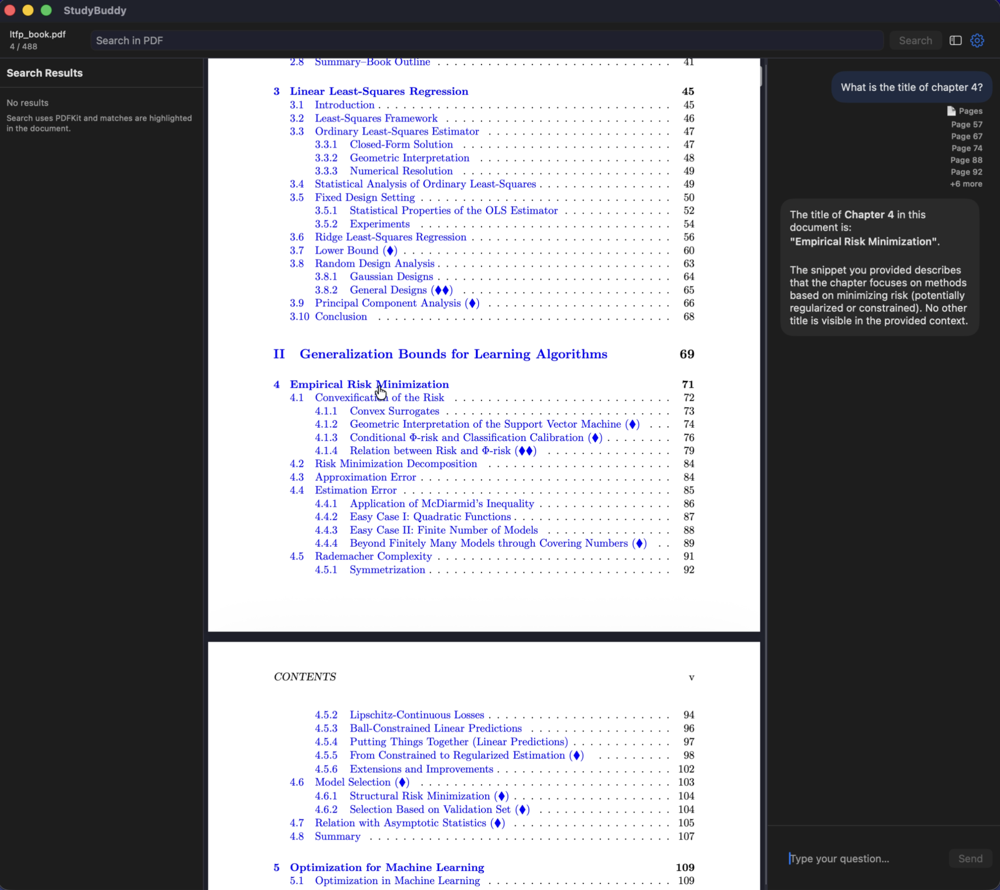

# StudyBuddy

A macOS PDF reader that pairs your textbook / research paper with a **local Ollama** chatbot.

<!-- Limit screenshot size on the page, but keep it clickable to the full-resolution image. -->
<a href="screenshot_screenbuddy.png">
  
</a>

## Download

- **DMG (recommended):**
  https://github.com/abhiramm7/realClippy/blob/main/dist/StudyBuddy.dmg
  
  Open the DMG and drag **StudyBuddy** into **Applications**.
- **Source:** clone this repo and build in Xcode.

## Key features

- Read PDFs with PDFKit.
- Ask questions in a built-in chat panel.
- **Highlight text to use it as context** (fastest and most reliable).
- Search the PDF (PDFKit) and browse results in the left sidebar.

## Requirements

- macOS
- [Ollama](https://ollama.com) installed and running locally

## Setup (Ollama)

1) Verify Ollama is reachable:

```shell
curl -sS http://localhost:11434/api/version | cat
```

2) (Recommended) Pull the default model (see `StudyBuddy/config.json`):

```shell
ollama pull ministral-3:3b
```

Optional: list installed models

```shell
ollama list
```

## Quick start

1) Open any PDF.
2) Either:
   - **Highlight text** to anchor your question on a specific passage, or
   - Use **Search** to find relevant chunks.
3) Ask your question in the chat panel.

## Build & Run (from source)

```shell
# Open the project in Xcode
open StudyBuddy.xcodeproj

# Or build from the CLI
xcodebuild -project StudyBuddy.xcodeproj \
  -scheme StudyBuddy \
  -configuration Release \
  -destination 'platform=macOS' \
  build
```

## DMG build (for sharing)

```shell
chmod +x scripts/build_dmg.sh
./scripts/build_dmg.sh
```

This produces:
- `dist/StudyBuddy.dmg`

## Notes

- Default Ollama base URL and model are configured in `StudyBuddy/config.json` (overridable in Settings).
